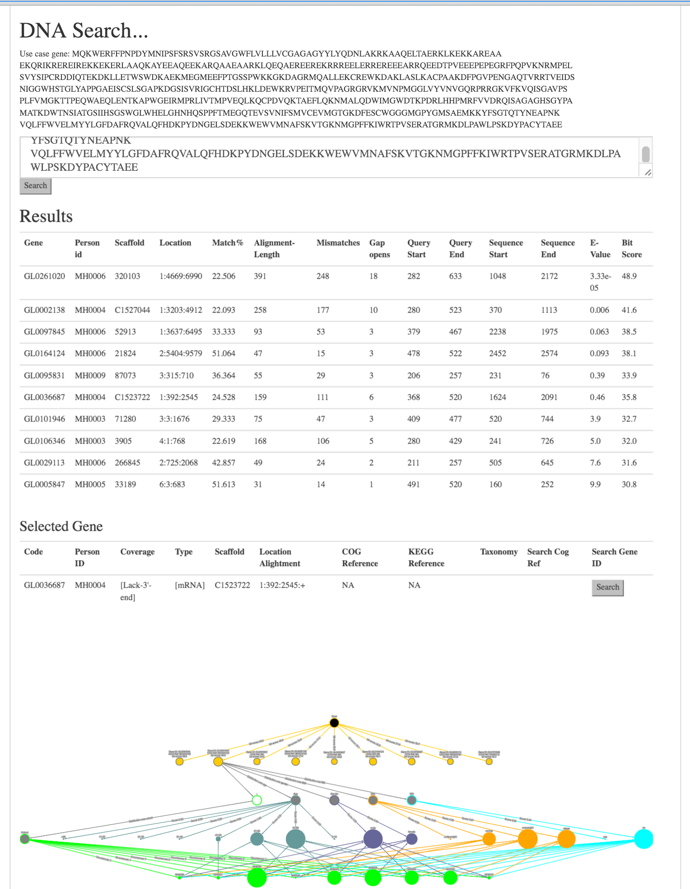
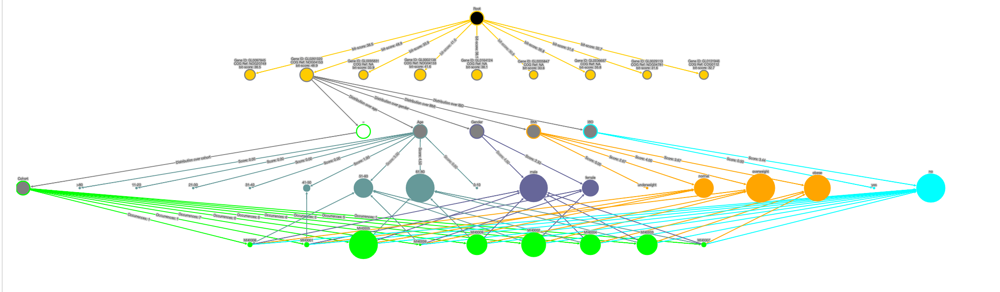
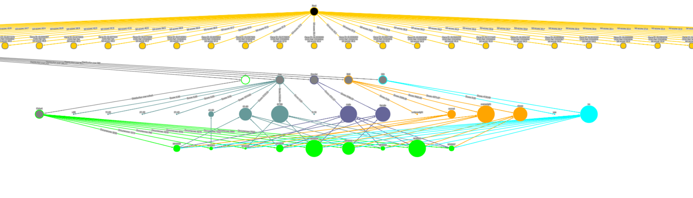
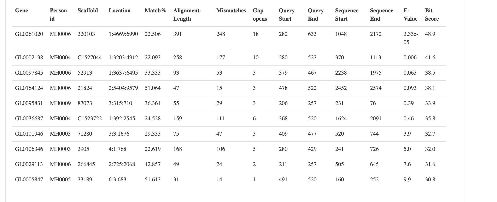
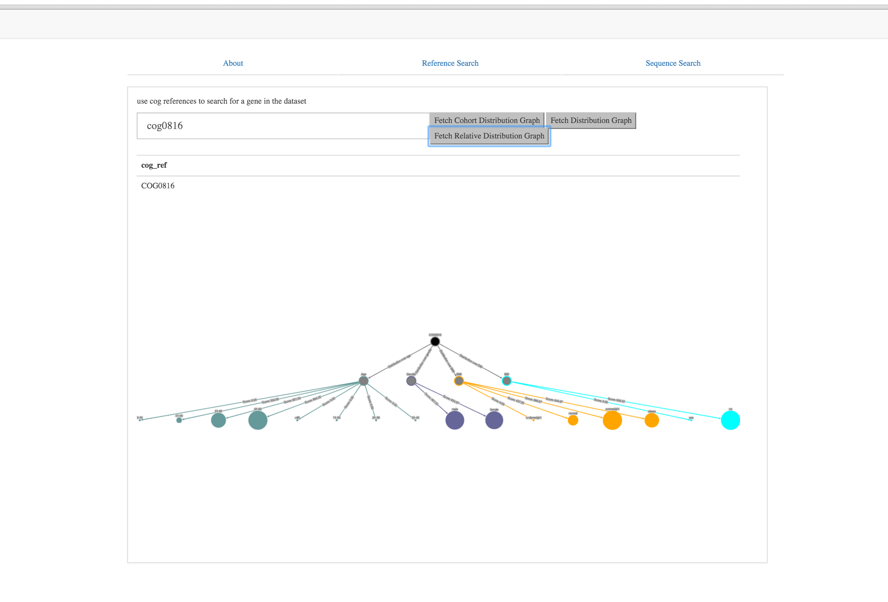

# Genomics Project

Tool i created to allow single gene analysis from any gene in the dataset obtained from "A human gut microbial gene catalogue established by metagenomic sequencing" by Junjie Qin1, Ruiqiang Li1, Jeroen Raes et al.
A BLAST search was run on the non-redundant microbial gene catalogue mapping these results to the redudant gene catalogue. This resulted in a dataset showing the occurence of that gene and also its similarity to all other genes. This was filtered to only give results above a cetain threshold.
With this information the script files in this project were used to seed the database and correctly annotate the data.
Finally this information was used to feed a cytoscape graph which allowed a user to traverse through the dataset, run similarity searches on genes, and find out its metagenomic occurence within the study.


## Getting Started

Clone and connect to mongo database.

```
npm install
```

To emulate this project it would require the original BLASTED data files to seed the database which are too large to store here.

## Functionality
* Search the database for genes with a matching COG identifier
* Perform a BLAST search on the database to find all similar genes to a given DNA sequence.
* Display the results in a cytoscape graph and tabular form.
* Expand nodes to find similar nodes based on either its COG reference or GENE IDENTIFIER.
* Hover over nodes of a type to move everything else out of focus - highights selected path / group.

## Screenshots







## Built With

* Node.js
* Angular.js
* Mongo DB
* Cytoscape.js - for generating node graphs

## Authors

* **Geoff Whitehead - (https://github.com/geoffwhitehead)

## License

This project is licensed under the MIT License - see the [LICENSE.md](./LICENSE.md) file for details
